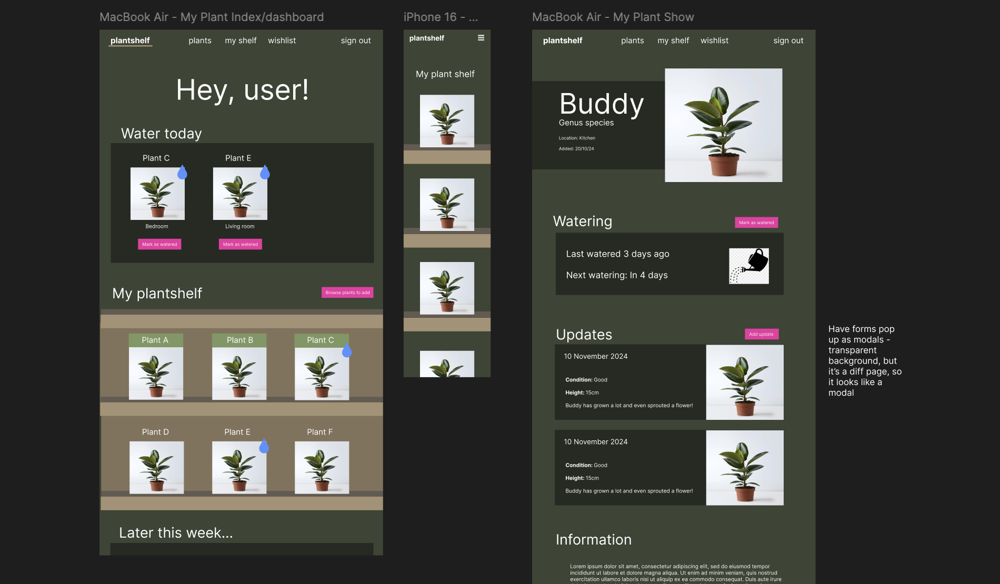
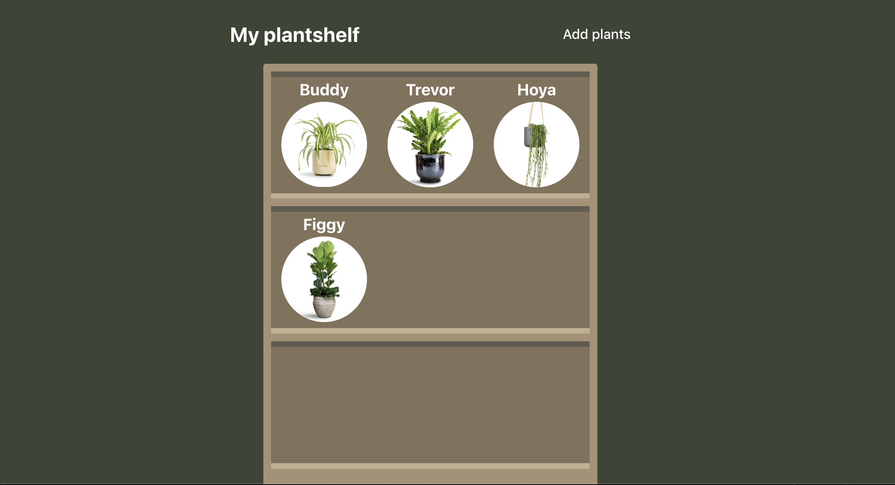

# plantshelf 🌱


### 🔗 Links

**Deployed website**: [plantshelf](https://plantshelf.netlify.app/)

This project is comprised of two repositories, one for the front end and another for the back end:

* [Front-end GitHub repository](https://github.com/david-millett/plantshelf-frontend) (the current repository)
* [Back-end GitHub repository](https://github.com/david-millett/plantshelf-backend)

### 📅 Timeframe

* 1 week

### 🙋 Working Team

* Solo

## Description

*plantshelf* is an app that allows users to learn about different types of house plants, add them to a virtual shelf to track their collection, and inform them when they need to water each one.

Upon visiting the site, users are greeted with a landing page. As an unauthenticated user, they are able to view a list of different types of common house plants. By clicking on one of these, they can find out information about the plant and details on how to care for it. To interact more deeply with the website, they must sign up for an account. Once logged in, the home page will direct them to a dashboard page where they can view any outstanding/completed tasks and an index of all the plants they own.

To 'create' a new plant - in other words, add one to their collection - they head to the specific type of plant they want to add and click on the 'Add to shelf' button. This renders a pop-up form where they can fill in the relevant details. Their new plant will then appear on their 'plant shelf' on the homepage! The plant shelf is designed to look like a bookshelf and is dynamically generated with empty shelves based on how many plants they own to maintain the bookshelf illusion. As their collection grows, additional shelves will be rendered if necessary to hold all the plants.

The app also tracks the date when each plant was last watered. Every type of plant species has a its own watering interval. The app tracks how many days have passed since they were last watered - if the plant is due or overdue to be watered, it will show up on the homepage to alert the user. They can mark it as watered with a click of a button from the dashboard, or the plant's individual page.

## Technologies Used

*plantshelf* is a full-stack CRUD project, created with the following technologies:

Back end:
* Python
* Django
* PostgreSQL

Front end:
* React
* JavaScript
* SCSS

## Brief

This project was completed as part of a brief on a software engineering bootcamp course at General Assembly.

I was tasked with planning and creating an app using Django and Python for the back end, using a postgreSQL database. The front end was to be created using React.

Deliverables included:
* User stories on *Trello*
* Wireframe for the app's main pages
* An ERD for the app's data and the relationships between that data
* GitHub repos for the front and back ends
* The deployed website

## Planning

I created a wireframe/mock up of the website in *Figma*. This is where I decided on the main colour scheme of the site as well as its layout for each page. My colour scheme was inspired by plants themselves, utilising greens, browns, and pinks - which are, of course, often the colours of leaves, bark, and flowers, respectively.


Building on the idea of the website being a virtual collection of plants, I thought it would be a cool idea to literally display the plants on a shelf, which inspired the app's name, *plantshelf*. Creating a shelf that is dynamically generated to display the plants sounded like a fun and challenging idea, so I was keen to push myself and include it.



I summarised all of my routes in a routing table. This contained routes to view the:
* Landing page/dashboard
* `GET` routes for the plant index and show routes
* Full CRUD functionality for my_plants, including `GET`, `POST`, `DELETE`, `PUT`, and `PATCH` requests
* `GET`, `POST`, and `DELETE` routes to view a wishlist of wanted plants
* Sign up and sign in routes


I created an ERD table in `dbdiagram` to determine how I would store the data in my database and what all the relationships between them would be.


My complete user stories was arranged onto a *Trello* board. I divided the project into MVP, phase 1 stretch, and phase 2 stretch goals to help organise the priority of tasks.


## Build/Code Process

### Django back end

I started by working on the back end. My project had four main apps - the first one I made was the `plants` app, which was fairly simple, as it only required `GET` routes. This was followed by the `locations` app, which contained information on the rooms where users could keep their plants. I used generics for this one to try both ways of creating views. I also implemented seeding to populate the database for their associated models to enable better testing.

Next was the `users` model, creating the routes that would allow users to sign up for and sign in to the app. I was keen to push myself and add additional functionality, so I researched how to give users the option of using their email or username to sign in!

```
class SignInView(APIView):

    def post(self, request):

        u_or_e = request.data.get('username_or_email')
        password = request.data.get('password')

        # Find the user with matching username or email
        user = User.objects.get(Q(username=u_or_e) | Q(email=u_or_e))

        # Check plain text password from request body against stored hash
        if hashers.check_password(password, user.password):
            # Generate token using simpleJWT
            token_pair = RefreshToken.for_user(user)

            serialized_user = UserSerializer(user)

            return Response({
                'user': serialized_user.data,
                'token': str(token_pair.access_token)
            })
        
        # Send 401 if passwords don't match
        return Response({ 'detail': 'Unauthorized' }, status.HTTP_401_UNAUTHORIZED)
```

I saved the `my_plants` app until last, because its model has a lot of relationships with the previous models, so it made sense to create it once they were completed. This app is also where the bulk of the app CRUD functionality resides. It was also the most complex - for example, I made sure that the index `GET` route was filtered so that users would only be able view their own plants, and not those of other users:

```
# Index controller
# Route: GET /my_plants/
@handle_exceptions
def get(self, request):
    my_plants = My_plant.objects.select_related('species', 'owner', 'location').filter(owner=request.user.id)
    serialzer = PopulatedMyPlantSerializer(my_plants, many=True)
    return Response(serialzer.data)
```

As well as authenticating this and the show route, I created a custom `IsOwner` permission class for the `RetrieveUpdateDestroyMyPlantView(APIView)` view to further protect the `my_plants` routes. All error handling was handled in an `exceptions.py` file. This helped make my lines of code in the views files cleaner by wrapping them in its `handle_exceptions()` function.

### React front end

At this point, I was ready to move onto the front end. As I was using React to create this, I was keen to make use of components to organise my code and save on repetition by allowing me to reuse them to. For example, I created a `PlantInfo` component which could be used to show the same information on both plant and my_plant show pages by passing down the appropriate information to them.

I used the component library *Mantine* to help create the modal pop-up forms. I wanted the experience of using the site to feel smoother and leaner by using modals for all forms on the site - including sign up, sign in, my_plant create, and my_plant update forms. To add some visual flair, I used an icons library, *tabler*, to integrate a large range of visual icons to the site. I think this allows data and information to be displayed in a much more appealing and compact way.

### Styling with Sass

After making my pages, I used sass to style them. Most individual pages and components had their own `.module.scss` file, but I also had a `main.scss` file to handle site-wide styling. I ensured that my colours were all saved to a `_variables.scss` file, enabling me to keep the site consistent and easily change colours across the whole site if needed.

One of my final tasks was to create a dyanmic bookshelf (aka the eponymous plantshelf) to display the user's own plants - which you can find out more about in the 'Wins' section!

## Challenges

Like in all projects, I was faced with challenging moments when creating this app.

### Generating a token on sign in

In the back end users `views.py` file, figuring out how to automatically generate a token to sign in a user after they sign up for an account took some thinking and research to implement. This had caused me no issue in the sign up route, because the user already existed, but in this route, the user was being created at the same time.

My final code which solved this is below:

```
class SignUpView(APIView):
    def post(self, request):
        new_user = UserSerializer(data=request.data)
        new_user.is_valid(raise_exception=True)
        created_user = new_user.save()

        token_pair = RefreshToken.for_user(created_user)

        return Response({
            'message': 'Signup successful',
            'user': new_user.data,
            'token': str(token_pair.access_token)
        })
```
At first, I was trying to create the `token_pair` using the `new_user`. While I was scrutnising the code and error messaging, trying to figure out why this wasn't working, I realised that the `new_user` represented data that wasn't actually of a saved user in the database yet - this, of course, meant it didn't have a user id associated with it. This explained my error message, which informed me that the `new_user` didn't have an id. So, I then defined the `new_user.save()` - where I was actually creating the user with this data, including assigning it an id - as `created_user`, meaning I could then successfully use this to generate my token and improve user experience.

### Update forms

In the front end, my update form also caused some problems. Whenever I tried submitting the form, I received an error:

```
AxiosError
Request failed with status code 400
{"species":["Incorrect type. Expected pk value, received dict."],"owner":["Incorrect type. Expected pk value, received dict."],"location":["Incorrect type. Expected pk value, received dict."]}
```

This error info showed me that form was trying to update the species, owner, and location for the `MyPlant` with the entire dictionary. This was because I was populating these in my back end in my `GET` show route when fetching the data. This was an unintended consequence of that, because I didn't want to replace the pks with all the full dictionary of populated data.

To sort this, I tried a few solutions, but settled on specifically assigning the data to be just the ids before setting the form data:

```
useEffect(() => {
    const fetchMyPlant = async () => {
        try {
            const { data } = await show(myPlantId)
            data.species = data.species.id
            data.owner = data.owner.id
            data.location = data.location.id
            setFormData(data)
        } catch (error) {
            console.log(error)
        }
    }
    if (myPlantId) fetchMyPlant()
}, [myPlantId])
```
This stopped the issue from occurring! At first, I had tried to assign this directly in the MyPlant show route in the `myPlantService.js` file, but then this didn't let me edit the data in the forms - bringing it into the `useEffect()` on the `MyPlantForm.jsx` form solved this.

### Redirecting and closing modals

The `MyPlantForm.jsx` is a component that I reused for both creating and updating myPlants. The `handleSubmit()` function dynamically changes depending on whether there is a `myPLantId` present, which means it is editing an already created myPlant.

After updating or creating the myPlant, it should navigate away from the page - this worked perfectly for the create route, but didn't work at all when updating a myPlant. I wanted it to navigate away from the form and go to the updated myPlant show page. I soon realised the huge flaw - because my forms were all pop-up modals, the url was exactly the same for the show page and the form! I solved this by, instead of navigating away after updating the myPlant, passing down the `close()` and `fetchMyPlant()` functions down to the form component and using them to close the modal and then refresh the data:

```
const handleSubmit = async (e) => {
        e.preventDefault()
        try {
            let res
            if (myPlantId) {
                res = await update(myPlantId, formData)
                close()
                fetchMyPlant()
            } else {
                res = await create(formData)
                navigate(`/my_plants/${res.data.id}`)
            }
        } catch (error) {
            console.log(error)
        }
    }
```

### Slow performance

One of the biggest problems I faced was the website being extremely slow to load data. This was especially apparent for my_plants data, which seemed to be because they had three sets of relationships with other data, which meant accessing the data from the database was taking a long time. After some research, I used `select_related` in the back end's my_plant index route, which significantly boosted the app's performance when loading and modifying my_plants data.

```
my_plants = My_plant.objects.select_related('species', 'owner', 'location').filter(owner=request.user.id)
```

 ## Wins

Overall, I am very pleased with this project, as I managed to meet my goals and rise to the challenges I set myself.

### The watering system

I am so happy that the watering system works cleanly and smoothly - I managed to make it so that you can set the plants as 'watered' from their individual show pages and also from the dashboard where you receive a list of watering tasks that need doing. I think this section gives great visual feedback to user: it shows all the plants that need watering and allows you to simply click a button to mark them as watered. Doing so changes the text of the button and deactivates it. The beauty of this section is that it also shows all plants that were watered on the current day - this means user have a visual way to keep track of tasks they have already completed on the current day. 


This section also reminds users of where the specific plant is located and warns them if any of the tasks are overdue. If there are no tasks due, this section displays a message telling the user that they have no tasks to complete. If users wish to water any of their plants early, they can do so from the plant's individual page. Again, the button deactivates if the plant was already watered on the same day. This page also shows in exactly how many days the next watering event is required.


To create this function, I added two main features to my models: in the `plants` model, every species of plant has a `water_interval` field, which is a number representing how many days that species requires between waterings. in the `my_plants` model, I created a `last_watered` field, which accepts a date for when that specific plant was last watered. The front end of the website then uses the current date to compare how many days have passed since this date to calculate whether watering is due again.

```
// Watering schedule
const today = new Date()
const lastWatered = new Date(myPlant.last_watered)
const difference = lastWatered.getTime() - today.getTime()
const differenceInDays = Math.ceil(difference / (1000 * 3600 * 24))
const nextWatering = differenceInDays + myPlant.species.water_interval
```

To allow users to set their plants as watered with just a click of a button, I made it so that button performed the following `handleSubmit()` function:

```
const handleSubmit = async (e) => {
    e.preventDefault()
    try {
        await patchUpdate(myPlantId, {last_watered: yyyymmdd})
        fetchMyPlant()
    } catch (error) {
        console.log(error)
    }
}
```
As you can see, the button sends a `PATCH` request to update the `last_watered` field to be `yyyymmdd`, which is simply the current date, `today.getDate()`, formatted how the database prefers.

### The plant shelf!

I am also very pleased with the eponymous plant shelf! This part of the project was the most difficult part of the project to properly get my head around. The problem was thus: I wanted the plants to be displayed on a bookshelf, but I also wanted to keep the integrity of the bookshelf shape. To solve this, I settled on generating shelves with the plants on them while also generating empty shelves  independently of the plants if necessary.



I decided to fix the bookshelf at a width of three plants. The app therefore checks to see whether there is any remainder left over after dividing the number of plants the user has by three. If the remainder is two, it has to generate one empty shelf to complete the full shelf width. If the remainder is one, it will generate two. To further sell the illusion of a bookcase, I decided to set the height at a minimum of three shelves tall. If the user does not have seven plants to partially fill three shelves, it will generate empty rows to create them. Once the user adds more plants, further shelves will freely be added to the bookcase.

```
const MyPlantList = ({ myPlants }) => {
    return (
        <main className={styles.container}>
            <ul>
                <li>
                    <div className={styles.shelfTop}></div>
                </li>
                {myPlants.map(plant => {
                    return (
                        <Link key={plant.id} to={`/my_plants/${plant.id}/`}>
                            <li>
                                <div className={styles.shelfShadow}></div>
                                <h3>{plant.nickname}</h3>
                                
                                <div className={styles.shelfFloorShadow}></div>
                                <div className={styles.shelfFloor}></div>
                            </li>
                        </Link>
                    )
                })}
                {myPlants.length % 3 === 2 ? <EmptyShelf />
                : myPlants.length % 3 === 1 ? <><EmptyShelf /><EmptyShelf/></>
                : myPlants.length === 0 ? <><EmptyShelf /><EmptyShelf/><EmptyShelf/></>
                : ''
                }
                {myPlants.length < 4 ? <><EmptyShelf /><EmptyShelf/><EmptyShelf/><EmptyShelf /><EmptyShelf/><EmptyShelf/></> 
                : myPlants.length < 7 ? <><EmptyShelf /><EmptyShelf/><EmptyShelf/></>
                : ''}
                <div className={styles.shelfTop}></div>
            </ul>
        </main>
    )
}
```

In the end, it is certainly a stylised bookshelf and it sometimes felt like a crazy undertaking, but I had the vision and I wanted to pull it off! In the end, there are definitely improvements that could be made, for example, the plants float slightly above the shelves, but I am overall pleased with overall effect.

## Key Learnings/Takeaways

This was my first back end made with Django, posrgreSQL, and python. I learned a lot through using them and am really interested in further using postgreSQL to manage databases, I find it very satisfying to store, retrieve, and query data! 

It was also my first solo project with a React front end and I became a lot more confident in using it as a result of this project.

On the personal side, I learned that it is ok and beneficial to experiment and try new things. Although I displayed my plants on a shelf in my plan, I did consider not including this feature in the final project because it didn't feel like a straight forward thing to include. Figuring it out and experimenting with different solutions was so rewarding in the end.

## Future Improvements

There are several ways that I would like to improve the app:

* **More detailed data** - For example, the website could calculate different watering intervals for different seasons.
* **Better rooms/location** - Users could make their own rooms/locations - as `locations` is already an app in the back end, this should be fairly easy to implement. Users could then have different shelves for different rooms, if they desired.
* **Calendar, etc** - Building on the bookshelf concept, I could add other itema to the top of the bookshelf and empty shelves. Users could add a clock, calendar, or books to the shelf. Users could click on the calendar to bring up a calendar view to see a visual representation of when their upcoming tasks are.
* **Error handling** - Error handling on forms, this is a feature that sadly I didn't get around to in the time I had, and I would like to add some feedback when forms can't be submitted.
* **Other upgrades** - Simple structual upgrades, such as a burger menu in mobile view.
